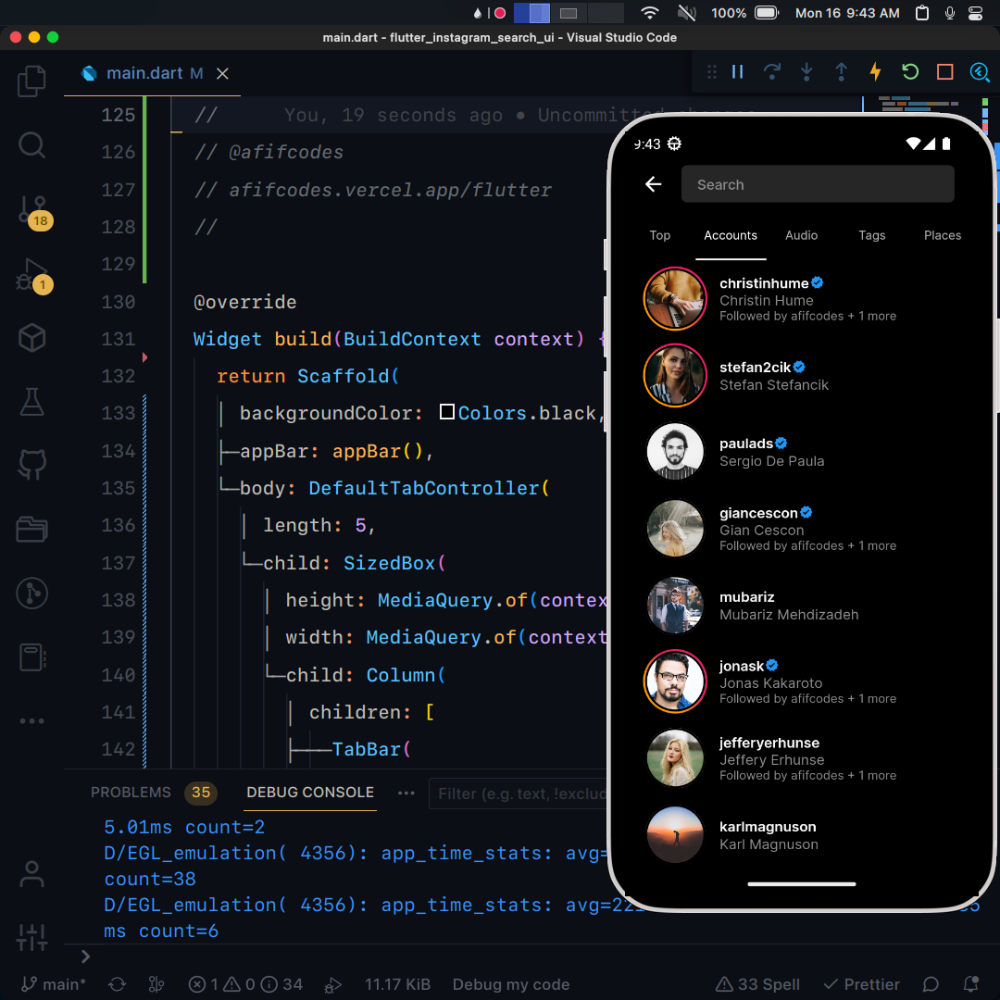

## Flutter UI - Instagram Search

```dart
void main() => runApp(const MaterialApp(
      debugShowCheckedModeBanner: false,
      home: MainScreen(),
    ));
```

## Development Setup
```
git clone https://github.com/afifcodes/flutter-instagram-search-ui.git
cd flutter-instagram-search-ui
flutter pub get
flutter run
```

## Screenshots


## Links

* [Website](https://afifcodes.vercel.app/flutter)
* [Youtube channel](https://youtube.com/afifcodes)
* [Instagram](https://instagram.com/afifcodes)
# flutter_instagram_search_ui

A new Flutter project.

## Getting Started

This project is a starting point for a Flutter application.

A few resources to get you started if this is your first Flutter project:

- [Lab: Write your first Flutter app](https://docs.flutter.dev/get-started/codelab)
- [Cookbook: Useful Flutter samples](https://docs.flutter.dev/cookbook)

For help getting started with Flutter development, view the
[online documentation](https://docs.flutter.dev/), which offers tutorials,
samples, guidance on mobile development, and a full API reference.
